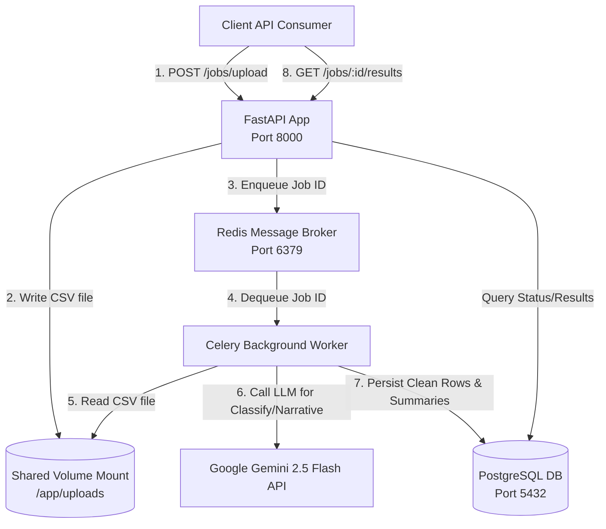
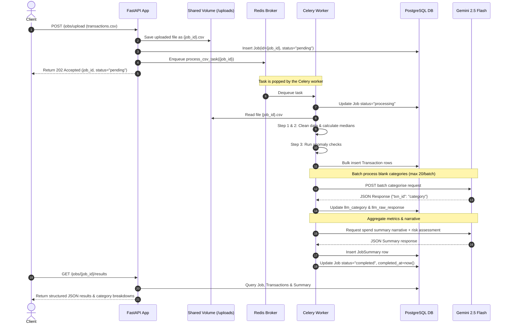

# TransactIQ: AI-Powered Transaction Processing Pipeline

Welcome to **TransactIQ**—a premium, asynchronous backend architecture engineered to ingest, clean, and analyze dirty financial transactions, flag anomalies, and leverage **Google Gemini 2.5 Flash** to classify missing categories and generate executive summaries.

---

## 🏗️ System Architecture Blueprint

This diagram illustrates how all containerized services communicate with each other:



---

## 🔄 Request Lifecycle & Sequence Flow

Here is the exact step-by-step path a single upload takes from the moment it hits our API endpoint to database persistence and back:



---

## 💡 Architectural Decisions: The "Why"

* **FastAPI**: Handles high-concurrency requests asynchronously, leverages Pydantic for validation, and automatically hosts interactive Swagger documentation at `/docs`.
* **Celery + Redis**: Decouples heavy computations and LLM APIs from the web request thread. Redis acts as a fast broker and task result backend.
* **PostgreSQL & Alembic**: Relational database to enforce integrity between `jobs`, `transactions` and `job_summaries` tables with cascading deletes. Database migrations are executed **automatically on container startup**.
* **Shared Volume (`/app/uploads`)**: Bypasses passing large files through Redis or storing bloated raw blobs in PostgreSQL, allowing the API and worker to communicate via files saved on shared disk volume.
* **Gemini 2.5 Flash**: Selected for speed, cost efficiency, and structured JSON output configuration (`response_mime_type="application/json"`), ensuring valid database payload mapping.
* **Graceful Degradation**: If no `GEMINI_API_KEY` is provided, the pipeline switches to a keyword-based rule classifier and fallback narrative builder to keep the pipeline executable out-of-the-box.

---

## 🛡️ Security Wall & Hardening

TransactIQ implements a multi-layered security architecture protecting all financial data endpoints:
- **API Key Authentication**: All endpoints under the `/jobs` prefix require the `X-API-KEY` header. Configure your custom key in the `.env` file (`API_KEY` parameter).
- **Redis-Backed Rate Limiting**: All routes are protected by a sliding-window rate limiter (default: 15 requests per minute per IP). If Redis is unavailable, it gracefully degrades to a thread-safe in-memory sliding-window limiter.
- **Strict CORS & HTTP Security Headers**: Hardened CORS policies restrict API requests to whitelisted dev ports, and middleware enforces `X-Frame-Options: DENY`, `X-Content-Type-Options: nosniff`, and custom CSP layers.
- **Input Sanitization & XSS Defense**: All merchant names and transaction notes parsed from CSV uploads are automatically stripped of HTML tags, `javascript:` prefixes, and inline script event handlers (`onload`, `onerror`, etc.).
- **MIME & Size Restrictions**: Enforces a strict 10MB upload limit and rejects uploads mismatching valid CSV MIME signatures (`text/csv`).
- **Security Auditing**: Authentication failures, file blocks, and input sanitization triggers generate structured `SECURITY ALERT` warning messages in the application logs.

---

## 🚀 Getting Started

### 1. Prerequisites
- Docker and Docker Compose
- Google Gemini API Key (get one at [Google AI Studio](https://aistudio.google.com/))

### 2. Configuration Setup
Copy `.env.example` to `.env`:
```bash
cp .env.example .env
```
Open `.env` and fill in your Gemini API key:
```env
GEMINI_API_KEY=AIzaSy...
```

### 3. Launching the Services
Run the entire container stack with a single command:
```bash
docker compose up --build
```
Interactive docs will immediately become available at [http://localhost:8000/docs](http://localhost:8000/docs).

---

## 📡 API Reference & CURL Examples

### 1. Upload a CSV File
Upload a CSV dataset of transactions to start processing.
```bash
curl -X POST -H "X-API-KEY: transactiq_secret_key" -F "file=@transactions.csv" http://localhost:8000/jobs/upload
```
**Response**:
```json
{
  "job_id": "56238606-168a-4f3f-96ff-1f18ae87db08",
  "status": "pending",
  "message": "CSV upload accepted. Job enqueued for processing."
}
```

### 2. Poll Job Status
Retrieve the current status of the background execution job.
```bash
curl -H "X-API-KEY: transactiq_secret_key" http://localhost:8000/jobs/56238606-168a-4f3f-96ff-1f18ae87db08/status
```
**Response (when completed)**:
```json
{
  "job_id": "56238606-168a-4f3f-96ff-1f18ae87db08",
  "status": "completed",
  "filename": "transactions.csv",
  "row_count_raw": 95,
  "row_count_clean": 85,
  "created_at": "2026-06-10T00:33:00Z",
  "completed_at": "2026-06-10T00:33:03Z",
  "error_message": null,
  "summary": {
    "total_spend_inr": 1339922.99,
    "total_spend_usd": 74185.14,
    "anomaly_count": 10,
    "risk_level": "high"
  }
}
```

### 3. Retrieve Full Results
Retrieve the detailed structured output of the job, including normalized transactions, anomalies, per-category breakdown, and narrative.
```bash
curl -H "X-API-KEY: transactiq_secret_key" http://localhost:8000/jobs/56238606-168a-4f3f-96ff-1f18ae87db08/results
```
**Response**:
```json
{
  "job_id": "56238606-168a-4f3f-96ff-1f18ae87db08",
  "status": "completed",
  "summary": {
    "total_spend_inr": 1339922.99,
    "total_spend_usd": 74185.14,
    "top_merchants": ["IRCTC", "Flipkart", "Ola"],
    "anomaly_count": 10,
    "narrative": "Spending was concentrated on transport and travel, particularly with IRCTC and Ola. A total of 10 anomalies were flagged including several large dollar amounts.",
    "risk_level": "high"
  },
  "transactions": [
    {
      "txn_id": "TXN1065",
      "date": "2024-09-04",
      "merchant": "Flipkart",
      "amount": 10882.55,
      "currency": "INR",
      "status": "SUCCESS",
      "category": "Shopping",
      "account_id": "ACC003",
      "notes": "Refund expected",
      "is_anomaly": false,
      "anomaly_reason": null,
      "llm_category": null,
      "llm_raw_response": null,
      "llm_failed": false
    }
  ],
  "category_breakdown": {
    "Shopping": {
      "INR": 10882.55,
      "USD": 0.0
    }
  }
}
```

### 4. List All Jobs
List all processed uploads, optionally filtering by status.
```bash
curl -H "X-API-KEY: transactiq_secret_key" "http://localhost:8000/jobs?status=completed"
```
